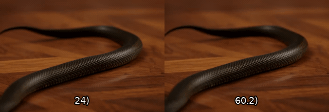

# The Pulse of Motion: Measuring Physical Frame Rate from Visual Dynamics

<p align="center">
  <a href="https://arxiv.org/abs/2603.14375"><b>Paper</b></a> &nbsp;|&nbsp;
  <a href="https://xiangbogaobarry.github.io/Pulse-of-Motion"><b>Project Page</b></a> &nbsp;|&nbsp;
  <a href="https://www.pulse-of-motion-leaderboard.com/"><b>Leaderboard</b></a> &nbsp;|&nbsp;
  <a href="https://huggingface.co/xiangbog/Pulse-of-Motion"><b>Model Weights</b></a>
</p>

> *"Not only do we measure the movement by the time, but also the time by the movement, because they define each other."* — Aristotle, *Physics*

**Visual Chronometer** predicts the **Physical Frames Per Second (PhyFPS)** of a video — the true temporal scale implied by its visual motion, independent of container metadata. We reveal that state-of-the-art video generators suffer from severe *chronometric hallucination*: their outputs exhibit ambiguous, unstable, and uncontrollable physical motion speeds.

<p class="leaderboard-promo" style="animation: fadeUp 0.7s ease 0.4s both;">
            <span class="promo-highlight">The PoM Leaderboard is now live!</span> 
            <br>
            <a href="https://www.pulse-of-motion-leaderboard.com/" target="_blank" class="leaderboard-link">Join us and test if your generated videos align with the pulse of motion</a>.
        </p>

<!-- Demo GIFs: Original (Meta FPS) vs. Corrected (PhyFPS) -->

<table>
<tr>
<td align="center" width="50%">

**"A Pomeranian dog chasing a soccer ball across a lawn."**
<br><sub>Original Meta FPS: 24 → PhyFPS: 35.8</sub>
<br>
</td>
<td align="center" width="50%">

**"A snake slithering across polished wooden floorboards."**
<br><sub>Original Meta FPS: 24 → PhyFPS: 60.2</sub>
<br>
</td>
</tr>
<tr>
<td align="center" colspan="2">

**"A detailed view of the churning white wake trailing behind a large ship."**
<br><sub>Original Meta FPS: 16 → PhyFPS: 44.9</sub>
<br>
</td>
</tr>
</table>

<sub>Left: Original generated video at container FPS. Right: Corrected to PhyFPS using Visual Chronometer. User studies confirm corrected videos are perceived as more natural.</sub>

---

## Installation

```bash
git clone https://github.com/taco-group/Visual_Chronometer.git
cd Visual_Chronometer/inference
pip install -r requirements.txt
```

## Model Weights

The released checkpoint is provided **for demo and leaderboard reproduction purposes only**.  
Please note that this checkpoint is **not identical to our strongest internal model**, which is not fully released at this time.

The checkpoint is **automatically downloaded** from Hugging Face when you first run inference, so no manual download is required.

Alternatively, you can download it manually:

| Model | Range | Download |
|-------|-------|----------|
| VC-Common | 10–60 FPS | [vc_common_10_60fps.ckpt](https://huggingface.co/xiangbog/Visual_Chronometer) |

Place the file in `inference/ckpts/`.

If you are interested in accessing the best-performing model, please contact **xiangbog@tamu.edu** and briefly explain your intended use in the email.

## Quick Start

### Predict PhyFPS for a single video

```bash
cd inference
python predict.py --video_path demo_videos/gymnast_50fps.mp4
```

Expected output:
```
============================================================
  Video: gymnast_50fps.mp4
  Average PhyFPS: 50.5
============================================================
   Segment        Frames   Mid Frame    PhyFPS
  --------  ------------  ----------  --------
         0      0-29             15      54.9
         1      4-33             19      52.2
         2      8-37             23      50.8
         ...
       AVG                                50.5
```

### Predict PhyFPS for a directory of videos

```bash
cd inference
python predict.py --video_dir path/to/videos/ --output_csv results.csv
```

### Demo videos

Three demo videos with known ground-truth FPS are included in `inference/demo_videos/`:

| Video | Ground Truth | Predicted PhyFPS | Error |
|-------|-------------|-----------------|-------|
| `gymnast_24fps.mp4` | 24 FPS | 24.2 FPS | 0.8% |
| `gymnast_30fps.mp4` | 30 FPS | 30.3 FPS | 1.0% |
| `gymnast_50fps.mp4` | 50 FPS | 50.5 FPS | 1.0% |

## PhyFPS-Bench-Gen

A benchmark of 100 prompts for auditing the temporal consistency of video generators. See [`PhyFPS-Bench-Gen/README.md`](PhyFPS-Bench-Gen/README.md) for usage.

**Quick evaluation:**

```bash
# 1. Generate videos with your model
your_model --prompts PhyFPS-Bench-Gen/prompts.txt --output generated/

# 2. Predict PhyFPS
cd inference
python predict.py --video_dir ../generated/ --stride 4 --output_csv results.csv
```


## Citation

```bibtex
@article{gao2026pulse,
  title={The Pulse of Motion: Measuring Physical Frame Rate from Visual Dynamics},
  author={Gao, Xiangbo and Wu, Mingyang and Yang, Siyuan and Yu, Jiongze and Taghavi, Pardis and Lin, Fangzhou and Tu, Zhengzhong},
  journal={arXiv preprint arXiv:2603.14375},
  year={2026}
}
```

## Star History

[](https://www.star-history.com/#taco-group/Pulse-of-Motion&Date)

## License

<!-- This project is released under [CC-BY-NC-ND](LICENSE). -->
